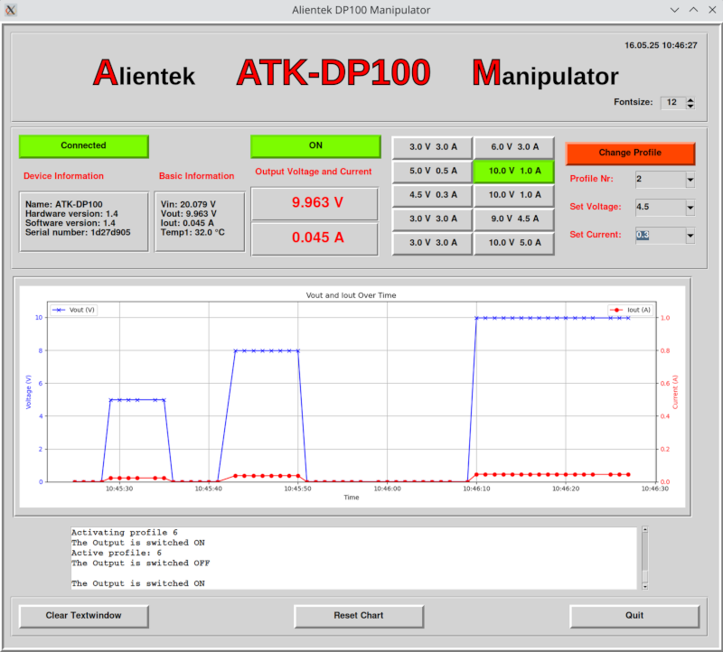

# Alientek DP100 manipulator

## All infos on: <https://www.weigu.lu/other_projects/python_coding/dp100_manipulator/index.html>

## Some infos

I love Linux, but mostly software is only written for Windows and Mac. Unfortunately the USB data transfer protocols of products 
are often proprietary and so it's hard to write software for Linux. But with the USB sniffer Cynthion from Great Scott Gadgets it's getting easier.
I sniffed the protocol of an Alientek DP100 power supply. The result is on: <https://www.weigu.lu/other_projects/usb/cynthion/index.html>.

With this information I was able to write a first version of a Python program doing the most important things needed. 
It uses `hidapi` under Linux and Python Tkinter GUI. Unfortunately it must be run as root. Even with udev rules and all rights set it was not possible
to use it without `sudo`.
